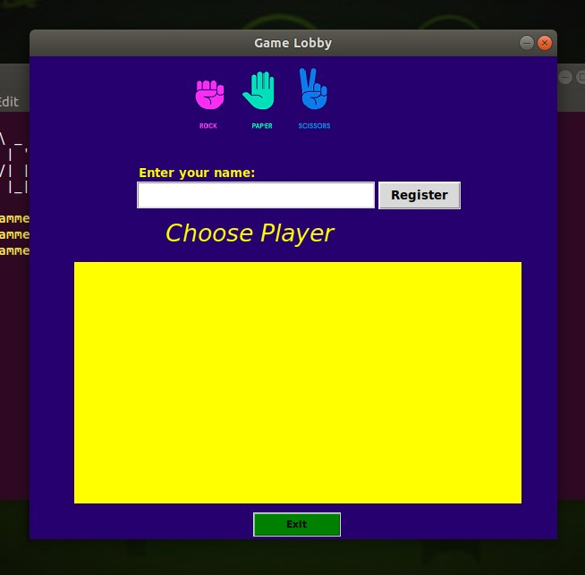
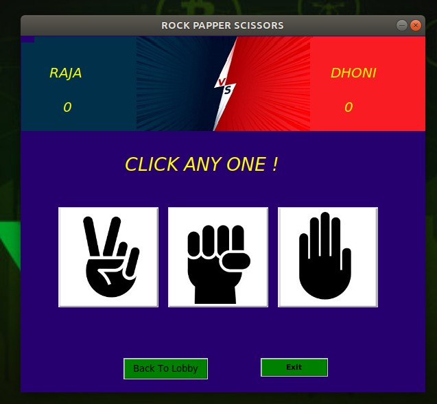

# RPS_Battel
This is Dualplayer game using firebase database 

# how this work ?
  
 First it ask user to register the player by entering his name and the player  details are  send to database to stored 

 <prev>
  The data is 
 
  data = { 
                    "name": s.my_name, #player name  
                    "is_playing": "0",  #used to check if player is playing  
                    "p_move": "0",   # player move which weapon the player is choosed (1-scssisor 2-rock 3-papper)  
                    "p_key": "",   #a unique key to identified the opponent player 
                    "inv": "0",   # if any player invite him to play mean it change  to 1 
                    "p_name": "",   # this name for the opponent player name   
                } 
  </prev>
   

 

 After player registered sucess. the active  player name are shown in text area. player need to select any one to battle or he need to wait untill some invite him to play  

 In background the two thread are created. one thread constantly checking if  player has any invite .second thread constantly  checking if any new  player came to play by checking the database if came it add the player name to textarea 

 If player1 select player2 to battle then the player2 data <b>inv </b> is changed to 1 by using the opponent unique key to edit the player2 data and the player1 name is add to player2 data <b>p_name : player1 </b> after player2 get notification that tell that player1 like to battle with you would llike to accept his invite 
if he accept the both player get in to the battle to play 

 how the player1 know that player2 accept the invite? 

 the player1 has thread which constantly check the player2 data <b>is_playing</b> if the data change 0 to 1 the player1 know that he accept the invite 
 if he reject the invite mean the data of is_playing is changed 0 to -1

 if both player get in to the battle then the player need to select any one weapon form the shown .if user select one then it add to player database and it check if player2 select his weapon if he select the weapon then the data is fetched from player2 database by using player2 unique key after the result is calculated and shown 

 

 what happen if player2 take more time to select the weapon ?

   
 then  the player1 will return to lobby and the battle get canceled 
  

 
 
# what are thing i learn from it ?
    <ul>
    <li> Firebase 
 To store the user move in database such that it can be acess by other player 
</li> 
    <li> Threading 
 To get the oppent move from the firbase database threading is used so the game won't get interupted 
 </li>
    </ul>
    

External module required  
 1.Requests  
 2.Firebase-python
 
